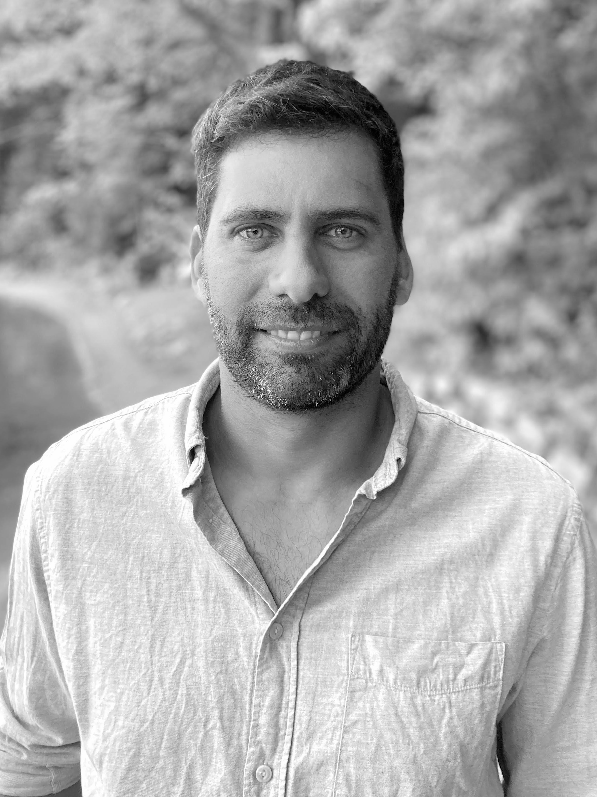

<link rel="stylesheet" href="styles.css" type="text/css">
<link rel="stylesheet" href="academicicons/css/academicons.min.css"/>

I am interested in research questions at the intersection of environmental policies, nature conservation, agricultural production, and livelihoods. Currently, I investigate the impact of corporate zero-deforestation supply chain commitments in the Brazilian soybean sector, using econometric modeling and large spatial and temporal data.  
My work focuses predominantly on understanding causes and the spatio-temporal dynamics of land-use changes to contribute to policy making and to a better understanding of human-environmental interactions.   
  
I received my Ph.D. from [Humboldt-Universität zu Berlin](https://www.geographie.hu-berlin.de/en) where I investigated interactions of land-use change (i.e., soybean and cattle ranching), environmental policies, and tropical deforestation in Brazil. Following, I was awarded a two-year Postdoctoral-Fellowship at the [Socio-Environmental Synthesis Center (SESYNC)](https://www.sesync.org/), University of Maryland. Currently, I am a Postdoctoral Researcher at the [Environmental Policy Lab (EPL) at ETH Zürich](https://epl.ethz.ch/) working in collaboration with the [Department of Earth & Environment at Boston University](http://www.bu.edu/earth/). 

  
My full CV is available [here](files/GollnowF_CV_09272022.pdf).